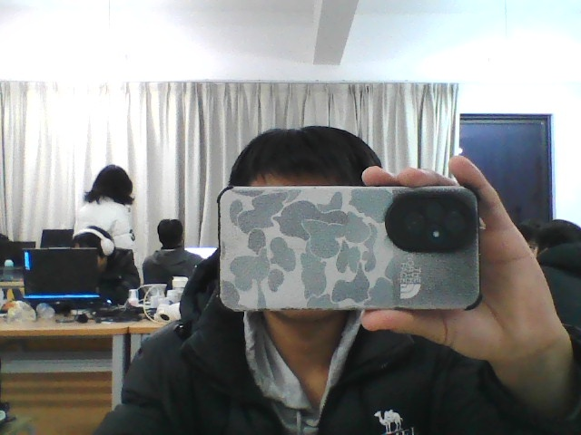
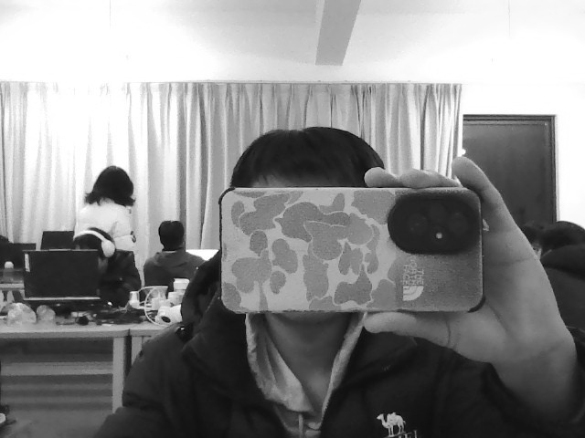

#

opencv

黄广松

一：opencv概述
在计算机视觉中opencv是一个开源的计算机视觉库，它提供了计算机视觉的算法和函数库，可以完成图像处理、人脸识别、人脸检测、人脸识别等任务。

二：opencv学习心得
1.计算机视觉的基础
学习了什么是计算机视觉以及图片的各个形式和格式，了解了计算机存储的机制与方法，从硬件方面了解工作原理
2.函数的调用
学习了基本函数的调用方法，以及函数的参数的含义.

https://github.com/user-attachments/assets/23a5d687-09cf-46ef-a688-f0ffcc2c017f

